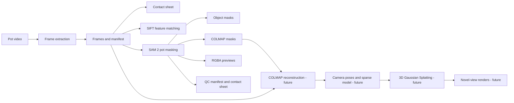

# System Architecture

## 1. Purpose

The Thai Ceramics Rendering Pipeline prepares photographs and video frames for
image-based 3D reconstruction of Thai pottery. The current implementation
covers dataset capture utilities, feature-matching experiments, foreground
mask generation, and quality control.

COLMAP reconstruction and 3D Gaussian Splatting are planned integration stages
and are not yet implemented in this repository.

## 2. High-Level Data Flow



## 3. Repository Structure

```text
thai-ceramics-rendering-pipeline/
├── README.md
├── IMPORTANT_INFO.md
├── environment-masking.yml
├── data/                         # ignored by Git
│   ├── raw/
│   │   └── videos/               # original pot recordings
│   ├── frames_output/            # extracted and selected video frames
│   └── processed/                 # generated outputs grouped by pot
│       ├── pot1-unglazed/
│       └── pot2-glazed/
├── docs/
│   ├── capture.md
│   ├── masking.md
│   ├── system-architecture.md
│   ├── reports/
│   │   ├── Computer Vision Project Paper Draft3 (w10).docx
│   │   ├── CSX4213 ComputerVision Project Paper Draft1.docx
│   │   ├── CSX4213 ComputerVision Project Paper Draft2.docx
│   │   └── Draft2 Progress Update Copy-Paste Text.md
│   └── templates/
│       ├── CSX4213_1_2026_Template.docx
│       └── conference-paper-template-a4.docx
├── scripts/
│   ├── capture/
│   │   ├── video_frame_extraction.py
│   │   └── build_frame_contact_sheet.py
│   ├── features/
│   │   └── demo_feature_matching.py
│   └── masking/
│       ├── mask_dataset.py
│       └── masking_core.py
└── tests/
    └── masking/
        └── test_masking_pipeline.py
```

Large datasets, model checkpoints, third-party repositories, and generated
outputs are intentionally excluded from Git through `.gitignore`.

## 4. Folder Responsibilities

| Path | Responsibility |
| --- | --- |
| `docs/` | Technical guides and system documentation. |
| `docs/reports/` | Weekly reports, project-paper drafts, and progress text. |
| `docs/templates/` | Original document templates used by the course. |
| `data/raw/` | Original, unchanged videos and photographs. |
| `data/frames_output/` | Frames extracted or selected from the original videos. |
| `data/processed/` | Masking outputs organized into one directory per pot. |
| `scripts/capture/` | Video-frame extraction, sampling, manifests, and contact sheets. |
| `scripts/features/` | Local-feature detection, descriptor matching, and geometric verification experiments. |
| `scripts/masking/` | Pot annotation, SAM 2 propagation, mask postprocessing, exports, and QC. |
| `tests/masking/` | Automated tests for dataset discovery, prompts, mask cleanup, outputs, and chunk processing. |
| `environment-masking.yml` | Reproducible Micromamba environment definition. |

## 5. Implemented Components

### 5.1 Capture

`scripts/capture/video_frame_extraction.py` performs the following tasks:

- Reads a source video with OpenCV.
- Saves every frame or every Nth frame.
- Defaults output to `data/frames_output/<video-name>_frames` when no output
  directory is supplied.
- Supports JPEG and PNG output.
- Records source-frame numbers, timestamps, resolution, frame rate, and
  sampling interval in `frames_manifest.csv`.
- Protects existing outputs unless `--overwrite` is supplied.

`scripts/capture/build_frame_contact_sheet.py` performs the following tasks:

- Discovers and naturally sorts image files.
- Reads `frames_manifest.csv` when available.
- Creates labeled thumbnails for rapid dataset review.
- Prevents unexpectedly large image canvases unless explicitly allowed.

### 5.2 Feature Matching

`scripts/features/demo_feature_matching.py` demonstrates the feature-matching
stage used by photogrammetry systems:

- Detects SIFT keypoints and descriptors.
- Matches descriptors using FLANN.
- Removes ambiguous matches with Lowe's ratio test.
- Optionally rejects geometrically inconsistent matches using fundamental
  matrix RANSAC.
- Saves a side-by-side visualization of verified correspondences.

This script is currently an experiment and is not yet connected to an
automated COLMAP pipeline.

### 5.3 Masking

`scripts/masking/mask_dataset.py` is the masking command-line interface. It
provides four commands:

| Command | Purpose |
| --- | --- |
| `doctor` | Checks Python packages, hardware devices, SAM 2, and the checkpoint. |
| `annotate` | Records an initial or corrective pot prompt. |
| `process` | Propagates masks and produces all derived outputs. |
| `review` | Reviews sampled or automatically flagged masks. |

`scripts/masking/masking_core.py` contains reusable masking operations:

- Frame and source-manifest discovery.
- Prompt normalization and validation.
- Temporary numeric frame staging for SAM 2.
- Binary-mask validation and temporal component selection.
- Hole filling, morphological cleanup, and COLMAP-mask erosion.
- RGBA, overlay, manifest, and contact-sheet generation.
- Sequence-level quality-control measurements and warnings.

## 6. Masking Outputs

A masking run creates the following structure inside its selected output
directory:

```text
OUTPUT/
├── prompts.json
├── run_metadata.json
├── mask_manifest.csv
├── qc_contact_sheet.jpg
├── masks_object/
├── masks_colmap/
├── rgba/
└── overlays/
```

| Output | Meaning |
| --- | --- |
| `masks_object/` | Full-resolution binary pot silhouettes. |
| `masks_colmap/` | Slightly eroded masks named according to COLMAP's mask convention. |
| `rgba/` | Original RGB pixels with the pot mask stored as alpha. |
| `overlays/` | Reduced-size visual previews for manual inspection. |
| `mask_manifest.csv` | Per-frame geometry, temporal consistency, file paths, and QC warnings. |
| `run_metadata.json` | Runtime, hardware, checkpoint, dependency, and processing settings. |
| `qc_contact_sheet.jpg` | Flagged frames and periodic samples for review. |

## 7. Runtime Architecture

The project uses the `pot-masking` Micromamba environment defined in
`environment-masking.yml`. The base environment provides Python, NumPy,
Pillow, and OpenCV. PyTorch, SAM 2, and the SAM 2.1 Hiera Tiny checkpoint are
installed separately because their correct builds depend on the processing
platform and GPU support.

Device selection follows this order when `--device auto` is used:

1. NVIDIA CUDA
2. Apple MPS
3. CPU

The masking pipeline uses overlapping frame chunks to limit GPU and system
memory use. Source frames are never renamed or overwritten.

## 8. Testing

`tests/masking/test_masking_pipeline.py` currently contains 13 tests covering:

- Natural frame sorting and manifest preservation.
- Image-dimension validation.
- Prompt coordinate conversion and prompt storage.
- Mask component selection, hole filling, and erosion.
- RGB and alpha preservation.
- COLMAP-compatible output naming.
- QC warning thresholds.
- Chunk overlap and overwrite protection.
- A complete simulated masking run using a fake SAM 2 predictor.

Run the suite from the repository root:

```powershell
python tests/masking/test_masking_pipeline.py
```

## 9. Planned Integration Points

The next architectural stages are:

1. Add a controlled frame-selection stage after contact-sheet review.
2. Run COLMAP feature extraction with the original RGB frames and
   `masks_colmap` directory.
3. Record registered cameras, sparse points, and reconstruction metrics.
4. Convert the COLMAP result into the input format required by the selected
   3D Gaussian Splatting implementation.
5. Train the scene and generate novel-view renders.
6. Evaluate withheld viewpoints and prepare the interactive presentation.

These stages should receive separate feature folders and tests only when their
implementations are added.
